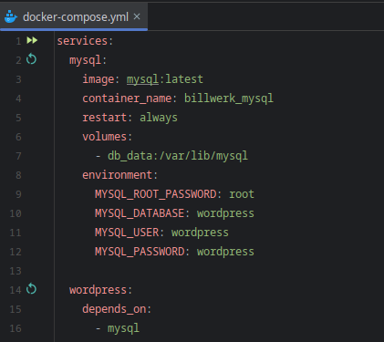
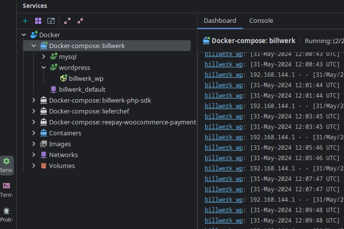
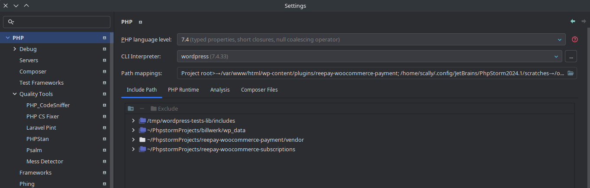
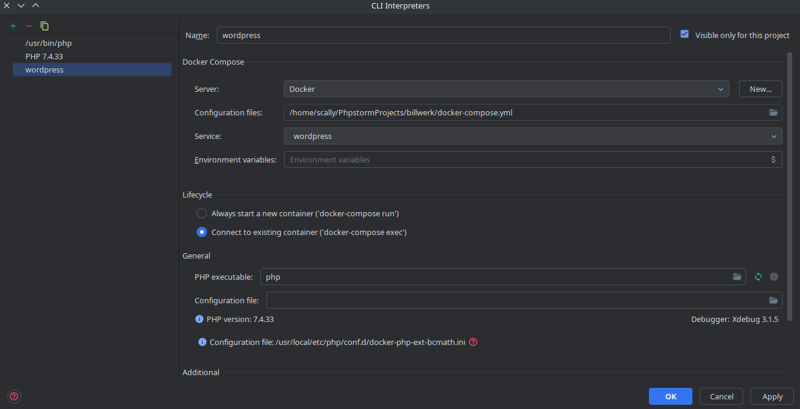

# Задача
Два плагина с разными code style в wordpress, сложно редактировать все в одном проекте, разработчики на разных OC

# Решение
Сделать все в разных проектах на одном уровне в файловой системе и связать через Docker, в данном случае в PhpStorm.

Текущий проект запускает сам сайт WP, mysql и выдает его по адресу localhost:8000, создает wp_data в котором весь сайт

Можно прицепить nginx и проксировать с конкретного домена или скипнуть этот шаг:

* в hosts прописать `127.0.0.1 site.local`
* в Nginx сделать конфиг для определенного сайта:

`
server {
    listen 80;
    server_name 127.0.0.1 site.local;

    location / {
        client_max_body_size 100M;
        proxy_pass http://127.0.0.1:8000;
        proxy_set_header Host $host;
        proxy_set_header X-Real-IP $remote_addr;
        proxy_set_header X-Forwarded-For $proxy_add_x_forwarded_for;
        proxy_set_header X-Forwarded-Proto $scheme;
    }
}
`

и убрать правила в дефолтном конфиге

# Запуск

Обычный через консоль `docker-composer up -d --build` в этой папке, или через phpstorm

# Phpstorm

В проекте с плагином настроить CLI Interpreter, указать Include paths чтобы были подсказки WP и другого плагина + можно указать либу для wp тестов, чтобы phpstorm дал запускать отдельные методы в phpunit тестах

Настроить composer

Надо заходить в composer.json и через phpstorm он будет делать запуск в контейнере

