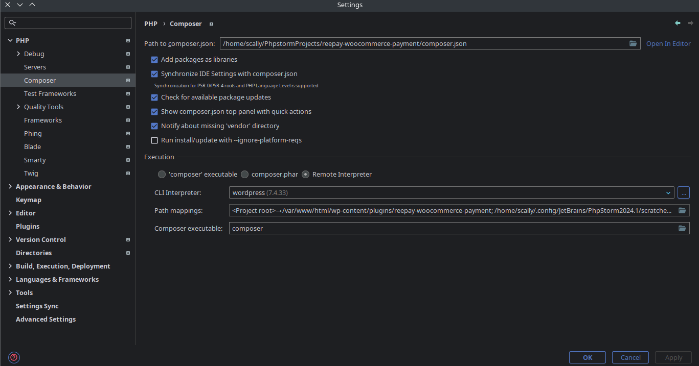
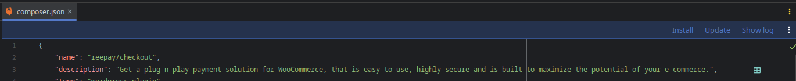
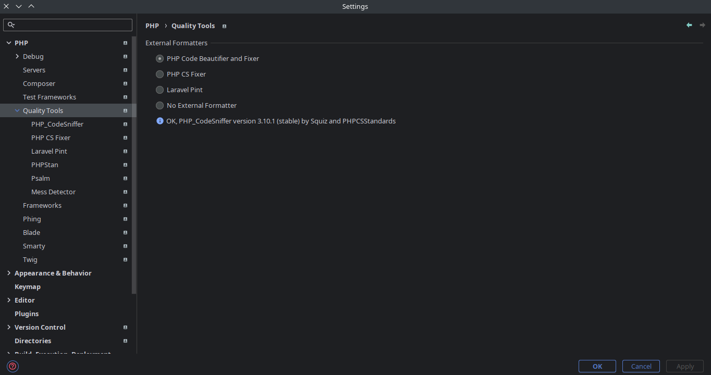
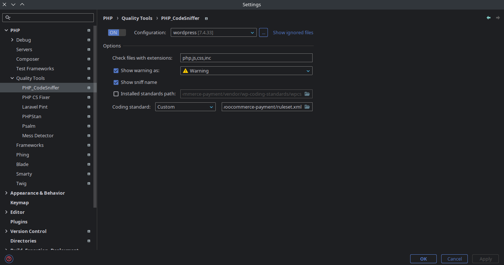
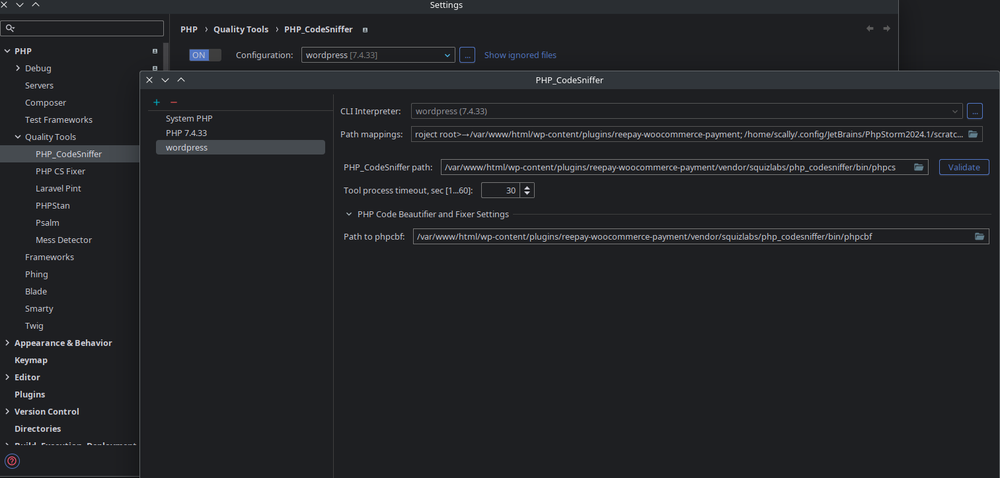
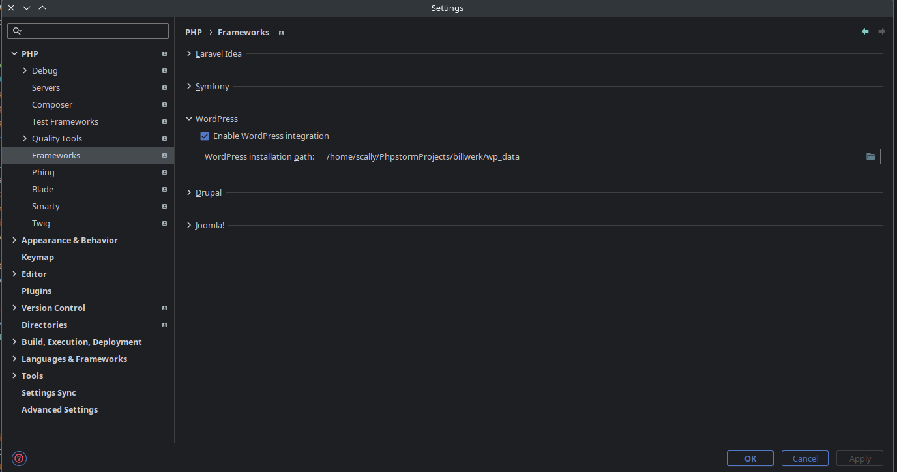

# Trouble
Два связанных плагина WP с разными code style, сложно редактировать все в одном проекте, разработчики на разных OC, разные версии PHP


# Решение
Сделать все в разных проектах Phpstorm на одном уровне в файловой системе и связать через Docker.

Текущий проект запускает сам сайт WP, mysql, подготоваливает в контейнере phpunit тесты для плагинов и выдает его по адресу localhost:8000, создает wp_data в котором весь сайт

Можно прицепить nginx(в Docker/локально) и проксировать с конкретного домена или скипнуть этот шаг:

* в hosts прописать `127.0.0.1 site.local`
* в Nginx сделать конфиг для определенного сайта:


```nginx
server {
    listen 80;
    server_name 127.0.0.1 site.local;

    location / {
        client_max_body_size 100M;
        proxy_pass http://127.0.0.1:8000;
        proxy_set_header Host $host;
        proxy_set_header X-Real-IP $remote_addr;
        proxy_set_header X-Forwarded-For $proxy_add_x_forwarded_for;
        proxy_set_header X-Forwarded-Proto $scheme;
    }
}
```


и убрать правила в дефолтном конфиге


# Плагины WP

Создать проекты Phpstorm со склонированными плагинами из Git, каждый отдельно. 

Прописать к ним пути в docker-compose.yml в volumes (локальный_путь:путь_в_контейнере). 

Переназвать container_name на свое усмотрение в docker-compose.yml если подгон под другой проект.


# Запуск

Обычный через консоль `docker-composer up -d --build` в этой папке, или через phpstorm


# Настройка Phpstorm

В проекте с плагином настроить CLI Interpreter, указать Include paths чтобы были подсказки WP и другого плагина + можно указать либу для wp тестов, чтобы phpstorm дал запускать отдельные методы в phpunit тестах


### Composer



Теперь можно заходить в composer.json и через phpstorm он будет устанавливать через docker с нужной версией php






### PHP_CodeSniffer

Выбрать Configuration

Обязательно убрать галку Installed standarts path, из-за этого не работало

Указать Coding standart в кастомном xml, если есть в проекте



При настройке конфигурации вроде все подтянет само, но я прописал пути phpcs + phpcbf относительно Docker




### WP

Можно выбрать интеграцию Wordpress




# Phpunit тесты Wordpress плагинов

Под проект billwerk все лежит в папке tests для установки.

`install-wp-tests.sh` можно изменить под свой проект и так же саму установку в `wordpress/Dockerfile`
